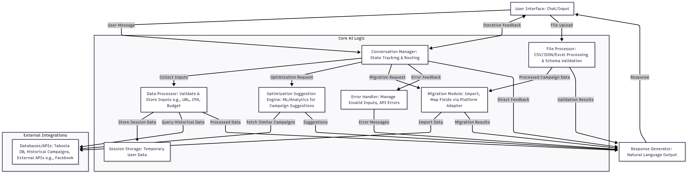

# Taboola Campaign Assistant

An AI-powered conversational application that helps advertisers optimize campaigns and migrate them from other platforms to Taboola.

## Features

- **Campaign Optimization**: Get data-driven suggestions for campaign settings based on historical Taboola data
- **Cross-Platform Migration**: Transfer campaigns from Facebook and Twitter to Taboola with automated field mapping
- **File Processing**: Upload and process campaign data from CSV, JSON, and Excel files with automatic validation
- **Conversational AI**: Natural language interaction powered by OpenAI
- **Real-Time Validation**: Immediate feedback on URLs, budgets, CPA values, and platform data

## Quick Start

### Prerequisites

- Python 3.8+
- OpenAI API key

### Installation

1. Clone the repository and navigate to the project directory
2. Install dependencies:
   ```bash
   pip install -r requirements.txt
   ```
3. Add your OPENAI_API_KEY to the .env file

### Running the Application

#### Web Interface (Recommended)
```bash
streamlit run streamlit_chat.py
```
Open your browser to the displayed URL (typically http://localhost:8501)


## Usage Examples

### Campaign Optimization
- "Analyze this campaign URL: https://example.com"
- "What budget should I set for a $5 CPA campaign?"
- "Optimize my campaign settings for better performance"

### Campaign Migration
- "Migrate my Facebook campaign to Taboola"
- "Transfer this Twitter campaign data"
- "Convert my social media campaigns"

### File Processing
- Upload CSV, JSON, or Excel files containing campaign data
- Automatic validation against platform-specific schemas
- Schema comparison and issue reporting for data quality assurance

## Architecture



The application follows a modular architecture with these core components:

- **Conversation Manager**: Orchestrates AI conversations with function calling
- **Data Processor**: Validates and processes user inputs
- **File Processor**: Handles file uploads and processes campaign data from CSV, JSON, and Excel formats
- **Optimization Engine**: Provides campaign suggestions based on historical data
- **Migration Module**: Handles cross-platform campaign transfers
- **Error Handler**: Centralized error management with user-friendly messages

## API Integration

Currently uses mock API implementations for:
- Taboola Backstage API
- Facebook Marketing API
- Twitter Ads API

## Dependencies

Key dependencies include:
- `streamlit` - Web interface
- `openai` - AI conversation capabilities
- `fastapi` - API framework
- `pydantic` - Data validation
- `python-dotenv` - Environment management

## Development

### Project Structure
```
core/                     # Core business logic
  - conversation_manager/ # AI conversation orchestration
  - data_processor/      # Input validation and processing
  - file_processor/      # File upload and campaign data processing
  - generator/           # AI response generation
  - optimization_engine/ # Campaign optimization logic
  - migration_module/    # Cross-platform migration
  - error_handler/       # Error management

external/                # External API integrations
  - api_clients.py      # API client implementations
  - api_contracts.py    # Abstract API interfaces

streamlit_chat.py       # Web interface
```

### Adding New Platforms

To add support for a new advertising platform:

1. Create a new API client in `external/api_clients.py`
2. Add schema mapping in `core/migration_module/schemas/`
3. Implement platform-specific transformations
4. Update the conversation manager to recognize the new platform
